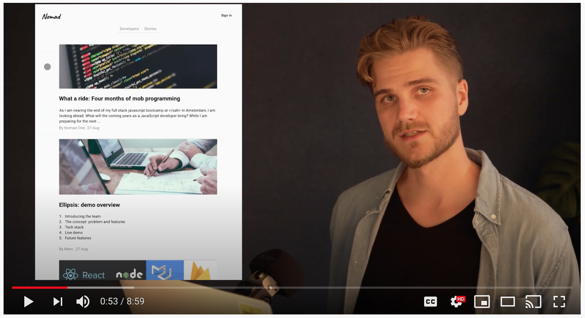
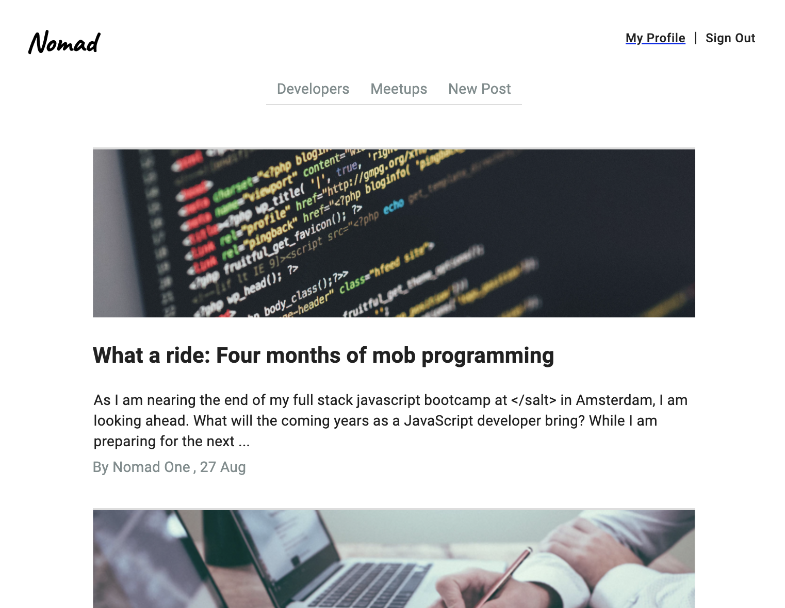

# Nomad: A Platform for Developers
**Nomad** is a two-week project built by four developers, graduating from an intense 14 week Full Stack JavaScript bootcamp.

Programming is problem solving, and we have experienced the value of studying and working together. It can be surprisingly enjoyable to follow along as someone is solving a problem, approaching it completely different than you would. Or to see someone approach the problem in a similar way, but subtly different. Our teamwork in the past months, and especially in the two weeks we took for this project, have convinced us of the need for a community around this phenomenon. **Nomad** provides the platform for this community.

## The product

Watch the pitch on youtube: [`Nomad demo`](https://www.youtube.com/watch?v=o5sWn9y_rU4&feature=youtu.be)

Try it here: [`nomad-final.herokuapp.com`](https://nomad-final.herokuapp.com/).

## Tech stack
* Front end: React, styling with MaterialUI
* Back end: NodeJS & Express
* Data storage: Firebase
* Automatic deployment:  Heroku

## About
This project was built with the concept of *mob programming*: 

### \</salt>: School of Applied Technology

Following a 14 week Full Stack JavaScript bootcamp
This project is the product of two weeks of team work.

### The team: Ellipsis
From personal experience, we can say that it has been an surprisingly good experience to be 'mob programming' together for the past months. 

## The future of Nomad
As with every project that is to be delivered, Nomad has an ever growing list of additional features. In no particular order, these are the features on our wishlist:

* Image upload functionality
  * Additionally: image cropping and scaling
* Streaming service for lectures and skill sharing
* Live chat between *friends*
* Improving meetup functionalities
  * Add list of attending 
* Advanced authorization